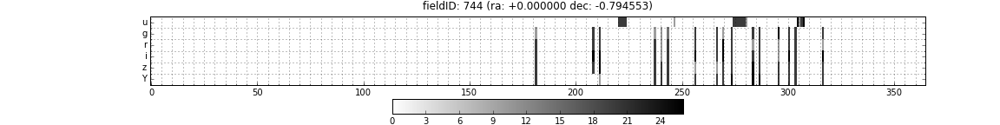

# Supernova Cosmology and Astrophysics

## Science Goals of Supernovae

* Supernova Cosmology: Use a sample of well-measured supernovae and past knowledge of supernovae behavior to obtain intrinsic brightnesses of supernovae and derive constraints on cosmology, particularly dark energy properties
* Related: Improvement of our understanding of the supernovae population. This 
includes understanding the distribution of SN properties in nature, and their correlation with their environments (host-galaxy properties, progenitor stars 
etc.)
* Use SN to study large scale structure, or deviations of the cosmology from 
FRW or certain galaxy populations. Largely, this is achieved by using SN as tracers of their host galaxies with the additional information about their distances being  well-measured.

* All of the stated goals stand to gain from increased numbers of well-measured supernovae. The first two goals, however, are indpendent of the spatial position of the supernovae, and do not necessarily gain if the same set of supernovae were distributed across a large region of the sky. The third goal, however, does require spatial coverage, and LSST is the only survey that could potentially do this.

To summarize, 
        * Need a large number of SN
        * Be able to detect SN candidates early enough for selective follow-up
        * classify SN types and from other possible transients 
        * Need a good determination of intrinsic brightness

## Requirement for these goals

* High precision calibrated flux measurement of mulitband supernova light curve
* Good temporal and wavelength (ie number of filters) sampling of the light curve
 
## Observing Strategy Characteristics

* Should have large number of epochs
* Distributed in multiple filters (the appropriate filters depend on z)
* Should be sampled roughly uniformly in time
        
## Exploring OpSims Outputs:

* We can study the cadence distribution by filter from the OpSim output directly in each field. The plot below shows the number of visits (or exposures) done in a particular field in different filters per night during the first season of Enigma_1189 in a DDF with coordinates as described. The grid shows a 5 day period to guide the eye. 

* We can study simulations of SN and apply classification and light curve fitting procedures to them in order to assess how well we can do with a simulated sample from OpSim. 
* We currently have two metrics that can be used in MAF that pertain to SN. We should try to understand how these metric values correlate with gains in light curve fits or cosmology as the opsims strategy changes.
* It is unclear how to account for the fact that our knowledge of SNIa might improve over time leading to larger gains for better strategies. 
* It is also unclear if some of this will be accounted for by improvements in intrinsic dispersion.

